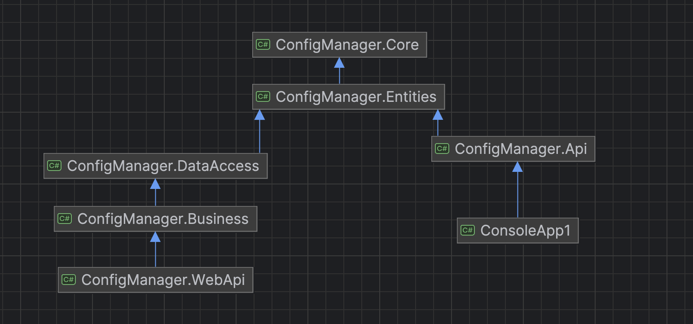

# ConfigManager
Dinamik olarak config değerlerini güncellememizi sağlayan bir tool.

### Kullanılan teknolojiler
- PostgreSql
- Redis
- RabbitMQ
- .net7
- docker

Bu proje PostgreSql üzerinde appname, key, value şeklinde uygulama bilgilerini tutar. 

WebApi ayağa kaltığında, aktif olan tüm dataları redis e yazar ve bir güncelleme geldiğinde ilgili exchange e güncellemeyi göndererek sürekli olarak güncel kalmasını sağlar.

ConfigManager.Api .netstandart2.1 olarak hazırlanmış ve tüm dotnet ortamlarında kullanılabilmesi amaçlanmıştır. Uygulama ayağa kalktığında kendine bir queue(autoDelete) açar ve ilgili exchange i bind eder. Böylece config değerlerini refresh etmeye gerek kalmadan küçük gecikmelerle queue üzerinden güncel kalır.
 Ufak bir örnek olarak ConsoleApp1 uygulamasına bakabilirsiniz.

Projeyi çalıştırmak için docker-compose dosyasını build etmek yeterlidir. 
`docker-compese up -d` 

WebApi 5001, WebUI 5002 portunda çalışmak üzere tanımlanmıştır.

Projeyi geliştirmek için;
* Tip kontrolleri daha sıkı uygulanabilir. 
* Uygulama bilgisi ayrı bir tabloda tutulup rastgele uygulama için key oluşturulması engellenebilir.
* Webapi ayağa kalktığında tüm dataları redis'e ve rabbit'e gönderiyor, bu işlem bir worker ile yapılabilir.

Proje Diagramı

